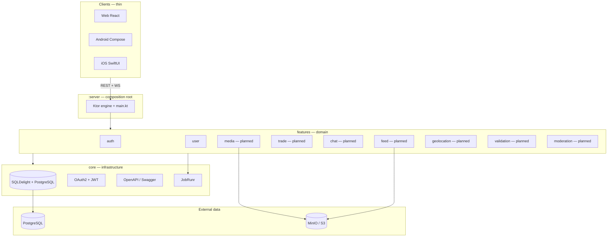

# Zula system architecture

High-level service boundaries, **Ktor module layout**, and who owns what. Route lists live in [api_index.md](./api_index.md).

---

## Gradle project layout

Gradle **root project** at repo root; backend is a single **`:server`** subproject. Logical modules are **packages under `server/src/main/kotlin/`**.

```text
zula/                              # root Gradle project (rootProject.name = "zula")
├── build.gradle.kts               # shared plugins (apply false)
├── settings.gradle.kts            # include(":server")
├── gradle/libs.versions.toml      # version catalog + Ktor BOM
│
└── server/                        # :server — Ktor entry & composition root
    ├── build.gradle.kts
    └── src/
        ├── main/
        │   ├── kotlin/            # all backend Kotlin
        │   │   ├── main.kt        # JVM entry only
        │   │   ├── app/           # composition root (Koin, route mounting)
        │   │   ├── core/          # infrastructure packages
        │   │   │   ├── database/  # SQLDelight .sq, HikariCP, migrations
        │   │   │   ├── security/  # OAuth2, JWT validation
        │   │   │   ├── openapi/   # API specs & Swagger UI
        │   │   │   ├── jobrunr/   # JobRunr + Postgres job storage
        │   │   │   └── contracts/ # Cross-feature Koin interfaces
        │   │   └── features/      # domain packages
        │   │       ├── auth/
        │   │       ├── user/
        │   │       ├── feed/
        │   │       ├── trade/
        │   │       ├── chat/
        │   │       ├── media/
        │   │       ├── geolocation/
        │   │       ├── validation/
        │   │       └── moderation/
        │   └── resources/
        │       └── application.yaml
        └── test/kotlin/
```

Common tasks (from repo root):

| Task | Description |
|------|-------------|
| `./gradlew :server:run` | Run API on port 8000 |
| `./gradlew :server:build` | Build server JAR |
| `./gradlew :server:test` | Server tests |
| `./gradlew test` | Same as `:server:test` today (only backend subproject) |

> **Current state:** flat sources in `server/src/main/kotlin/`. New work should move into `core/*` and `features/*` packages under that tree; `:server` stays one Gradle module.

---

## Ktor project layout

Production-ready modular Ktor server using **Koin, SQLDelight, OAuth2, OpenAPI, and JobRunr**. Package layout under `server/src/main/kotlin/` (`core/*`, `features/*`).

---

## Module file breakdown

### 1. `app` (composition root)

**`main.kt`** — JVM entry (`com.zula`). **`app/Koin.kt`** + **`app/Routing.kt`** — glue that:

- loads Koin modules (`core/*` + `features/*` packages)
- configures content negotiation, status pages, security
- starts JobRunr background job server (Postgres-backed)
- mounts global + feature routes

`application.yaml` lists `configure*` modules in boot order (HTTP → serialization → OpenAPI → Koin → database → JobRunr → security → routing).

### 2. `core/*` (infrastructure)

| Package | Owns |
|---------|------|
| **`core/database`** | `.sq` schemas; SQLDelight-generated DAOs; HikariCP factory; safe migration runner at startup |
| **`core/security`** | OAuth2 client configs, JWT issuer/validator, Ktor `Authentication` installs |
| **`core/openapi`** | OpenAPI YAML, route metadata, Swagger UI at `/swagger` |
| **`core/jobrunr`** | JobRunr fluent config; Postgres storage via Hikari; optional dashboard; `GET /jobs/ping` smoke |

### 3. `features/*` (domain silos)

Each feature is three layers:

| Layer | File pattern | Responsibility |
|-------|--------------|----------------|
| **Routing** | `*Routing.kt` | HTTP paths via Ktor DSL; request parsing; OpenAPI route docs |
| **Service** | `*Service.kt` | Pure business logic; transaction wrappers; coordinates DB + jobs |
| **Integration** | `*Consumer.kt` / `*Publisher.kt` | JobRunr handlers / `BackgroundJob.enqueue` publishers |

Example (`server/src/main/kotlin/features/feed/`):

```text
FeedRouting.kt      →  POST /api/v1/feed/items, GET /api/v1/feed/for-you
FeedService.kt      →  ranking SQL, trait batching, block filtering
FeedPublisher.kt    →  feed.item.created events
FeedConsumer.kt     →  media.embedding.completed → update item vector
```

---

## System context



---

## Feature ownership

| Feature | Owns | Does **not** own |
|---------|------|------------------|
| **auth** | OAuth callbacks, JWT sessions, provider registry | Profile fields, trust math |
| **user** | Identity reads, profiles, blocks, portfolio, documents, peer ratings (internal), admin trust bump | Feed items, trades, chat rooms |
| **feed** *(planned)* | `feed_items`, traits linkage, for-you ranking, author/trait lists | Profile readme, trade state |
| **media** *(planned)* | Presigned uploads, object key validation, async embeddings | Avatar/profile field updates (user validates URL) |
| **geolocation** *(planned)* | Fingerprint ingest, resolver → `location_tag` | Continuous GPS storage |
| **trade** *(planned)* | Trade lifecycle, templates, feed item lock | Validation codes, chat delivery |
| **validation** *(planned)* | PIN/QR sessions, handoff verify | Trade state (coordinates with trade) |
| **chat** *(planned)* | Rooms, messages, WS fan-out | Trade acceptance rules |
| **moderation** *(planned)* | Reports, admin actions, content hide | User-initiated block (user feature) |

---

## Module → doc → feature map

| User-facing area | Module doc | Primary feature |
|------------------|------------|-----------------|
| Sign in, sessions | [user_module.md](./user_module.md) | `features/auth` |
| Trust & ratings | user + [trust_events.md](./trust_events.md) | `features/user` |
| Public profile header | [seller_profile_module.md](./seller_profile_module.md) | `features/user` |
| README, portfolio, pins | [profile_portfolio_module.md](./profile_portfolio_module.md) | `features/user` |
| Marketplace feed | [feed_module.md](./feed_module.md) | `features/feed` |
| Categories | [traits_module.md](./traits_module.md) | `features/feed` (SQL + filters) |
| Uploads & AI tags | [media_module.md](./media_module.md) | `features/media` |
| Travel tags | [geolocation_module.md](./geolocation_module.md) | `features/geolocation` |
| Barter | [trade_module.md](./trade_module.md) | `features/trade` |
| Meetup verify | [validation_module.md](./validation_module.md) | `features/validation` |
| Trade chat | [chat_module.md](./chat_module.md) | `features/chat` |
| Reports & admin | [moderation_module.md](./moderation_module.md) | `features/moderation` |

---

## Profile page composition (no mega-endpoint)

Clients stitch multiple REST calls:

```text
GET /api/v1/sellers/{id}           → header + readme + pins (user)
GET /api/v1/portfolio              → portfolio tab (user)
GET /api/v1/feed/by-author/{id}    → listings tab (feed)
GET /api/v1/activity/public        → activity tab (user; needs feed data)
GET /api/v1/reviews/seller/{id}    → reviews tab (user)
```

---

## Overlap resolution (locked)

| Topic | Owner | Others reference |
|-------|-------|------------------|
| **Traits schema** | feed migration (`000002_feed`) | [traits_module.md](./traits_module.md) documents model only |
| **Presigned uploads** | media feature | Feed/seller/portfolio pass `object_key` strings |
| **Markdown bodies** | `documents` table (user helpers) | Feed/trade store `body_document_id` FK |
| **User blocks** | user feature RPCs | Moderation adds platform actions; chat/feed respect blocks |
| **Trust ledger writes** | user internal API | Trade/validation call in same transaction |
| **Pagination cursors** | Shared DTOs in `core/openapi` | See [conventions.md](./conventions.md) |

---

## Koin wiring in `app`

Current (flat `server/src/main/kotlin/`; target: `core/*` + `features/*` packages):

- `core/database`, `core/security`, `core/jobrunr` (fluent boot; no Koin module required)
- `features/auth`, `features/user` Koin modules
- **Cross-feature contracts** — Koin interfaces in `core/contracts`

```kotlin
// Injected into feature services — do not import sibling feature packages directly
single<BlockResolver> { get<UserService>() }
single<TrustLedgerWriter> { get<UserService>() }
single<SellerActivityWriter> { get<UserService>() }
```

Planned additions per [implementation_plan.md](./implementation_plan.md): feed → media → …

---

## Cross-feature internal API

Features **must not** import sibling `*Service.kt` classes directly. Inject Koin contract interfaces:

| Interface | Implementer | Callers (planned) | Purpose |
|-----------|-------------|-------------------|---------|
| `BlockResolver` | `UserService` | FeedService, ChatService | `resolveViewerBlock` — filter lists / delivery |
| `TrustLedgerWriter` | `UserService` | ValidationService, TradeService, ModerationService | `applyTrustEvent` — ledger + cache |
| `SellerActivityWriter` | `UserService` | FeedService | `syncSellerActivityStats` after feed writes |

Future interfaces (add when shipping):

| Interface | Purpose |
|-----------|---------|
| `ChatRoomEnsurer` | TradeService → create room on accept |
| `ContentModerator` | ModerationService → hide feed/chat/trade |

---

## Denormalized projection registry

Every cached/denormalized table needs an explicit write contract. Update this table when adding projections.

| Projection | Source of truth | Writer | Reader | Refresh strategy |
|------------|-----------------|--------|--------|------------------|
| `user_stats.explicit_rating_avg` | `user_ratings` | UserService (`recordPeerRating`, lazy recalc) | Profile routes | Lazy 1h TTL on profile read |
| `user_stats.implicit_trust_score` | `user_trust_ledger` | UserService (`applyTrustEvent`) | Profile routes | Immediate on write; lazy reconcile on read |
| `seller_activity_stats` | `feed_items` *(planned)* | FeedService via `SellerActivityWriter` | `GET /sellers/{id}` | Write-through on feed create/status change |
| `feed_item_cards` *(feed-F, optional)* | `feed_items` + joins | FeedService worker | `GET /feed/for-you` | Async projection job |

---

## Block policy (central)

All public profile reads use **strict hide** via `enforcePublicTargetAccess`:

- seller profile, readme, portfolio, reviews, public activity endpoints
- Authenticated viewer + block either direction → `404 Not Found`
- Anonymous viewers → no block check (discovery); optional auth enriches flags on seller profile

Feed and chat (when shipped) call `BlockResolver` — do not duplicate SQL.

---

## Document reference rules

| Rule | Detail |
|------|--------|
| **Create** | Owning feature creates `documents` row (`createDocumentForOwner` on UserService) |
| **Reference** | FK only (`body_document_id`); no duplicate markdown columns |
| **Ownership** | `owner_user_id` must match content author; assert on link |
| **List routes** | Omit full `source_markdown`; detail/readme endpoints return full body |
| **Format** | `format = 'markdown'` only; clients parse locally |

---

## Related

- [schema.md](./schema.md) — tables by module
- [auth_and_permissions.md](./auth_and_permissions.md) — route auth matrix
- [clients.md](./clients.md) — client responsibilities
- [conventions.md](./conventions.md) — SQLDelight, OpenAPI, tests
