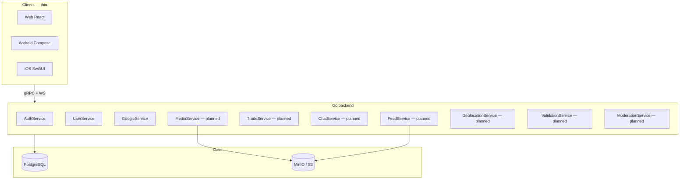

# Zula system architecture

High-level service boundaries and **who owns what**. Detailed RPC lists live in [api_index.md](./api_index.md).

---

## System context



---

## Service ownership

| Service | Owns | Does **not** own |
|---------|------|------------------|
| **AuthService** | OAuth, JWT sessions, provider registry | Profile fields, trust math |
| **UserService** | Identity cache reads, profiles, blocks, portfolio, documents, peer ratings (internal), admin trust bump | Feed items, trades, chat rooms |
| **GoogleService** | Google account metadata helper | Auth token exchange |
| **FeedService** *(planned)* | `feed_items`, traits linkage, for-you ranking, author/trait lists | Profile readme, trade state |
| **MediaService** *(planned)* | Presigned uploads, object key validation, async embeddings | Avatar/profile field updates (UserService validates URL) |
| **GeolocationService** *(planned)* | Fingerprint ingest, resolver → `location_tag` | Continuous GPS storage |
| **TradeService** *(planned)* | Trade lifecycle, templates, feed item lock | Validation codes, chat delivery |
| **ValidationService** *(planned)* | PIN/QR sessions, handoff verify | Trade state (coordinates with TradeService) |
| **ChatService** *(planned)* | Rooms, messages, WS fan-out | Trade acceptance rules |
| **ModerationService** *(planned)* | Reports, admin actions, content hide | User-initiated `BlockUser` (UserService) |

---

## Module → doc → service map

| User-facing area | Module doc | Primary service |
|------------------|------------|-----------------|
| Sign in, sessions | [user_module.md](./user_module.md) | AuthService |
| Trust & ratings | user + [trust_events.md](./trust_events.md) | UserService |
| Public profile header | [seller_profile_module.md](./seller_profile_module.md) | UserService |
| README, portfolio, pins | [profile_portfolio_module.md](./profile_portfolio_module.md) | UserService |
| Marketplace feed | [feed_module.md](./feed_module.md) | FeedService |
| Categories | [traits_module.md](./traits_module.md) | FeedService (SQL + filters) |
| Uploads & AI tags | [media_module.md](./media_module.md) | MediaService |
| Travel tags | [geolocation_module.md](./geolocation_module.md) | GeolocationService |
| Barter | [trade_module.md](./trade_module.md) | TradeService |
| Meetup verify | [validation_module.md](./validation_module.md) | ValidationService |
| Trade chat | [chat_module.md](./chat_module.md) | ChatService |
| Reports & admin | [moderation_module.md](./moderation_module.md) | ModerationService |

---

## Profile page composition (no mega-endpoint)

Clients stitch multiple RPCs:

```text
GetSellerProfile          → header + readme + pins (UserService)
ListPortfolioItems        → portfolio tab (UserService)
ListFeedByAuthor          → listings tab (FeedService)
ListPublicActivity        → activity tab (UserService; needs feed data)
ListSellerReviews         → reviews tab (UserService)
```

---

## Overlap resolution (locked)

| Topic | Owner | Others reference |
|-------|-------|------------------|
| **Traits schema** | Feed migration (`000002_feed`) | [traits_module.md](./traits_module.md) documents model only |
| **Presigned uploads** | MediaService | Feed/seller/portfolio pass `object_key` strings |
| **Markdown bodies** | `documents` table (UserService helpers) | Feed/trade store `body_document_id` FK |
| **User blocks** | UserService RPCs | Moderation adds platform actions; chat/feed respect blocks |
| **Trust ledger writes** | UserService internal API | Trade/validation call in same transaction |
| **Pagination cursors** | Shared messages in proto | See [conventions.md](./conventions.md) |

---

## Registration in `app.App`

Current (`apps/backend/internal/app/app.go`):

- AuthService, UserService, GoogleService
- **ModuleAPI** — cross-module contracts ([`internal/module`](../apps/backend/internal/module/contracts.go))

```go
app.ModuleAPI.Blocks         // module.BlockResolver
app.ModuleAPI.Trust          // module.TrustLedgerWriter
app.ModuleAPI.SellerActivity // module.SellerActivityWriter
```

Planned additions per [implementation_plan.md](./implementation_plan.md): FeedService → MediaService → …

---

## Internal module API (cross-service)

Other modules **must not** import `internal/service` from sibling packages. Use `app.ModuleAPI`:

| Interface | Implementer | Callers (planned) | Purpose |
|-----------|-------------|-------------------|---------|
| `BlockResolver` | UserService | FeedService, ChatService | `ResolveViewerBlock` — filter lists / delivery |
| `TrustLedgerWriter` | UserService | ValidationService, TradeService, ModerationService | `ApplyTrustEvent` — ledger + cache |
| `SellerActivityWriter` | UserService | FeedService | `SyncSellerActivityStats` after feed writes |

Future interfaces (add when shipping):

| Interface | Purpose |
|-----------|---------|
| `ChatRoomEnsurer` | TradeService → create room on accept |
| `ContentModerator` | ModerationService → hide feed/chat/trade |

---

## Denormalized projection registry

Every cached/denormalized table needs an explicit write contract. Update this table when adding projections.

| Projection | Source of truth | Writer | Reader | Refresh strategy |
|------------|-----------------|--------|--------|------------------|
| `user_stats.explicit_rating_avg` | `user_ratings` | UserService (`RecordPeerRating`, lazy recalc) | Profile RPCs | Lazy 1h TTL on profile read |
| `user_stats.implicit_trust_score` | `user_trust_ledger` | UserService (`ApplyTrustEvent`) | Profile RPCs | Immediate on write; lazy reconcile on read |
| `seller_activity_stats` | `feed_items` *(planned)* | FeedService via `ModuleAPI.SellerActivity` | `GetSellerProfile` | Write-through on feed create/status change |
| `feed_item_cards` *(feed-F, optional)* | `feed_items` + joins | FeedService worker | `ListForYouFeed` | Async projection job |

---

## Block policy (central)

All public profile reads use **strict hide** via `enforcePublicTargetAccess`:

- `GetSellerProfile`, `GetProfileReadme`, `ListPortfolioItems`, `ListSellerReviews`, `ListPublicActivity`
- Authenticated viewer + block either direction → `NotFound`
- Anonymous viewers → no block check (discovery); optional auth enriches flags on seller profile

Feed and chat (when shipped) call `ModuleAPI.Blocks.ResolveViewerBlock` — do not duplicate SQL.

---

## Document reference rules

| Rule | Detail |
|------|--------|
| **Create** | Owning service creates `documents` row (`CreateDocumentForOwner` on UserService) |
| **Reference** | FK only (`body_document_id`); no duplicate markdown columns |
| **Ownership** | `owner_user_id` must match content author; assert on link |
| **List RPCs** | Omit full `source_markdown`; detail/readme endpoints return full body |
| **Format** | `format = 'markdown'` only; clients parse locally |

---

## Related

- [schema.md](./schema.md) — tables by module
- [auth_and_permissions.md](./auth_and_permissions.md) — RPC auth matrix
- [clients.md](./clients.md) — client responsibilities
