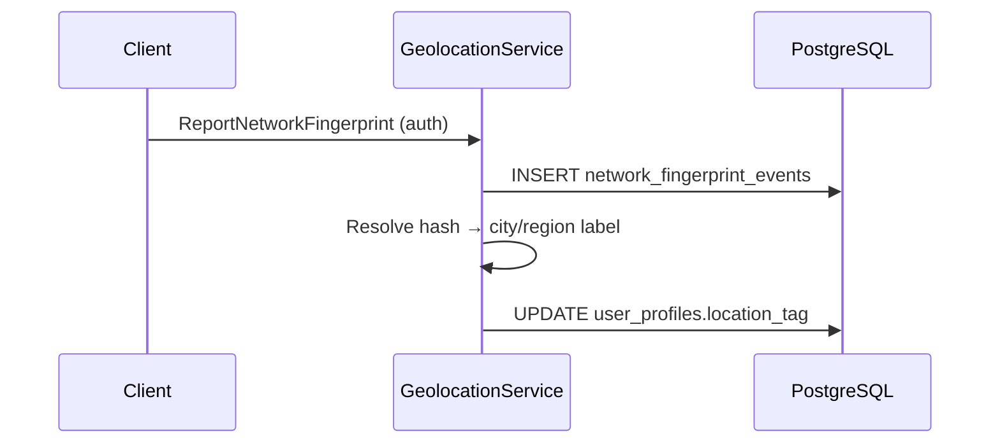

# Guide: Geolocation Module

**Not part of the starter kit.** See [product_vision.md](./product_vision.md).

Coarse location tags from network fingerprint shifts. No continuous GPS on the server.

**Status:** Doc complete · **Backend:** ⬜ · **Feature:** `features:geolocation`

**Depends on:** [user_module.md](./user_module.md) (`location_tag` column exists) · **Unblocks:** trip feed context (feed Wave 2)

**Master plan:** [implementation_plan.md](./implementation_plan.md) Wave 2.2 (`geo-A`) · **Product:** [product_vision.md](./product_vision.md)

**Related:** [schema.md](./schema.md#geolocation-module-planned--wave-2) · [README.md](../README.md) · [conventions.md](./conventions.md)

---

## Goals

| Goal | Detail |
|------|--------|
| **Client fingerprints** | Anonymized network snapshots on schedule or change |
| **Coarse label** | Resolver → `user_profiles.location_tag` |
| **Trip posts** | Optional denormalized tag on feed trip items |
| **Privacy** | No raw GPS; TTL on fingerprint events |
| **Not logistics** | Exact meetup / client addresses live on trade — not here |

---

## Architecture



Feature layout:

| Layer | File | Purpose |
|-------|------|---------|
| Routing | `GeolocationRouting.kt` | HTTP paths, OpenAPI metadata |
| Service | `GeolocationService.kt` | Ingest, resolver, profile tag updates |
| Integration | — | No MQ in MVP |

Register in Koin (`geolocationModule`) and mount routes from `Application.kt` via `configureGeolocationRouting()`.

---

## Schema

| Table | Purpose |
|-------|---------|
| `network_fingerprint_events` | Hashed fingerprints, jsonb metadata, TTL purge |

Writes to existing `user_profiles.location_tag`. Optional `feed_items.origin_location_tag` at post time.

**Next migration:** `000004_geolocation.sql` — [schema.md](./schema.md#geolocation-module-planned--wave-2)

---

## REST / OpenAPI surface

| Operation | Auth |
|-----------|------|
| `ReportNetworkFingerprint` | Auth, rate limited |

---

## Auth policy

Authenticated users only; rate limited per user/IP. [auth_and_permissions.md](./auth_and_permissions.md)

---

## Implementation phases

### Phase geo-A — Ingest & profile tag

- [ ] `network_fingerprint_events` table
- [ ] `ReportNetworkFingerprint` REST route
- [ ] Resolver stub (rule table or external API interface)
- [ ] Update `location_tag` on significant change
- [ ] Koin: `geolocationModule` + route mount in `Application.kt`
- [ ] Tests: `features/geolocation/src/test/kotlin/`

### Phase geo-B — Feed integration

- [ ] Snapshot tag on trip `feed_items` at create time

### Phase geo-C — Hardening

- [ ] TTL purge job
- [ ] User opt-out on profile
- [ ] Threat model doc section (no precise tracking)

---

## Verification

```bash
./gradlew :core:database:generateSqlDelightInterface
./gradlew :features:geolocation:test
./gradlew test
```

---

## File checklist

| Path | Purpose |
|------|---------|
| `core/database/src/main/resources/db/migration/000004_geolocation.sql` | Events table |
| `core/database/src/main/sqldelight/geolocation.sq` | SQLDelight queries |
| `core/openapi/src/main/kotlin/dto/` | OpenAPI DTOs |
| `features/geolocation/src/main/kotlin/.../GeolocationRouting.kt` | HTTP routes |
| `features/geolocation/src/main/kotlin/.../GeolocationService.kt` | Ingest + resolve |
| `features/geolocation/src/test/kotlin/...` | Tests |
| `docs/geolocation_module.md` | This guide |

---

## Open questions

| Question | MVP default |
|----------|-------------|
| Resolver accuracy | City-level string; no lat/long storage |
| Web vs mobile fingerprints | Same REST route; different client payload shapes |
| Opt-out default | Opt-in to fingerprint reporting in client settings |

---

## Related documentation

- [seller_profile_module.md](./seller_profile_module.md) — displays `location_tag`
- [feed_module.md](./feed_module.md) — trip posts
- [trade_module.md](./trade_module.md) — location decision matrix (logistics)
