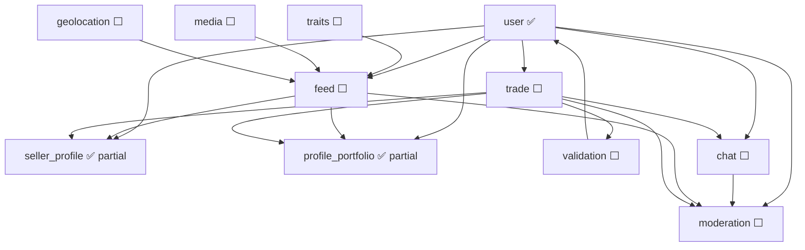

# Zula — Cross-Module Implementation Plan

Master rollout plan for modules **not yet implemented** in the backend, plus **remaining phases** on partially shipped modules.

**Related:** [README.md](../README.md) · [docs index](./README.md) · [architecture](./architecture.md) · [conventions](./conventions.md) · per-module guides in `docs/*_module.md`

---

## Current state (2026-06)

| Module | Doc | Backend | Notes |
|--------|-----|---------|-------|
| [user](./user_module.md) | Full | ✅ MVP | Auth, trust, blocks, profiles |
| [seller_profile](./seller_profile_module.md) | Full | ✅ A–B | Listings tab blocked on feed |
| [profile_portfolio](./profile_portfolio_module.md) | Full | ✅ A–B | Activity/feed body blocked on feed |
| [feed](./feed_module.md) | Full | ⬜ | **Critical path** |
| [traits](./traits_module.md) | Plan | ⬜ | Can ship inside feed Phase A |
| [media](./media_module.md) | Plan | ⬜ | MinIO in devenv only |
| [geolocation](./geolocation_module.md) | Plan | ⬜ | `location_tag` column exists |
| [trade](./trade_module.md) | Plan | ⬜ | — |
| [validation](./validation_module.md) | Plan | ⬜ | Trust ledger exists |
| [chat](./chat_module.md) | Plan | ⬜ | — |
| [moderation](./moderation_module.md) | Plan | ⬜ | `BlockUser` only |

---

## Dependency graph

---

## Recommended waves

Execute in order. Within a wave, items marked **∥** can run in parallel.

### Wave 1 — Marketplace core (blocks MVP demo)

**Goal:** Users can post, browse, and filter needs/offers/trips.

| Step | Module | Deliverable | Doc |
|------|--------|-------------|-----|
| 1.1 | **traits** | `traits` table, seed tree, SQLC, no standalone RPC yet | [traits_module.md](./traits_module.md) |
| 1.2 | **feed** Phase A–C | Schema, `FeedService`, `CreateFeedItem`, `ListForYouFeed`, blocks filter | [feed_module.md](./feed_module.md) |
| 1.3 | **feed** Phase D | `ListFeedByAuthor`, `ListFeedByTrait` | feed |
| 1.4 | **seller_profile** Phase C | Wire seller listings tab; sync `seller_activity_stats` | [seller_profile_module.md](./seller_profile_module.md) |

**Exit criteria:** Seller page = profile header + author feed; seed data browsable via gRPC.

---

### Wave 2 — Rich listings (media + location)

**Goal:** Image uploads, async tagging, trip/location signals on feed.

| Step | Module | Deliverable | Doc |
|------|--------|-------------|-----|
| 2.1 ∥ | **media** Phase A–B | Presigned upload RPC, object keys on feed/portfolio | [media_module.md](./media_module.md) |
| 2.2 ∥ | **geolocation** Phase A | Client-reported network fingerprint ingest, `location_tag` refresh | [geolocation_module.md](./geolocation_module.md) |
| 2.3 | **feed** Phase E | Async media embeddings, optional image vector blend | feed |
| 2.4 | **seller_profile** Phase D | `RequestAvatarUpload` | seller_profile |
| 2.5 | **profile_portfolio** Phase C | `feed_items.body_document_id`, list vs detail markdown | profile_portfolio |

**Exit criteria:** Create offer with photo; trip posts show coarse location tag.

---

### Wave 3 — Barter lifecycle

**Goal:** Two parties coordinate a swap/meetup and close it with trust impact.

| Step | Module | Deliverable | Doc |
|------|--------|-------------|-----|
| 3.1 | **trade** Phase A–B | `trades` schema, state machine, templates (swap / meetup) | [trade_module.md](./trade_module.md) |
| 3.2 | **chat** Phase A | Trade-scoped room, message persistence, WS gateway | [chat_module.md](./chat_module.md) |
| 3.3 | **trade** Phase C | Link feed item → trade; cancel/expire rules | trade |
| 3.4 | **validation** Phase A–B | PIN/QR generation, handoff verify, trust delta | [validation_module.md](./validation_module.md) |
| 3.5 | **user** | `RecordPeerRating` caller from validation; optional `SubmitRating` RPC | user_module |

**Exit criteria:** Alice offers → Bob starts trade → chat → meetup PIN → trust + rating unlock.

---

### Wave 4 — Profile depth & public history

| Step | Module | Deliverable | Doc |
|------|--------|-------------|-----|
| 4.1 | **profile_portfolio** Phase D | `ListPublicActivity` from fulfilled feed items | profile_portfolio |
| 4.2 | **trade** Phase D | `trade_public_disclosures`, opt-in summaries | trade |
| 4.3 | **profile_portfolio** Phase E | Case-study portfolio items linked to trades | profile_portfolio |
| 4.4 | **seller_profile** | `completed_trade_count` on activity stats | seller_profile |

---

### Wave 5 — Safety & scale

| Step | Module | Deliverable | Doc |
|------|--------|-------------|-----|
| 5.1 | **moderation** Phase A | `ReportUser`, report queue, auto-hide pending review | [moderation_module.md](./moderation_module.md) |
| 5.2 | **moderation** Phase B | Admin review RPCs, enforce on feed/chat/trade | moderation |
| 5.3 | **feed** Phase F | `feed_item_cards` projection (if metrics justify) | feed |
| 5.4 | **profile_portfolio** Phase G | Full-text search on `documents.source` | profile_portfolio |

---

## Migration numbering (next files)

All shipped schema lives in **`000001_init.up.sql`** (users, profiles, trust, blocks, documents, portfolio).  
**Next migration:** `000002_feed.up.sql` — **combine traits + feed** for Wave 1 (single file unless size forces a split).

| File | Wave | Module(s) |
|------|------|-----------|
| `000002_feed.up.sql` | 1 | traits + feed |
| `000003_media.up.sql` | 2 | media (or merge into feed if tables already stubbed) |
| `000004_geolocation.up.sql` | 2 | geolocation |
| `000005_trades.up.sql` | 3 | trade |
| `000006_chat.up.sql` | 3 | chat |
| `000007_validation.up.sql` | 3 | validation |
| `000008_moderation.up.sql` | 5 | moderation |

Canonical table index: [schema.md](./schema.md). Renumber before merge if plans change.

---

## Cross-cutting rules (all modules)

Single source: **[conventions.md](./conventions.md)** — thin clients, keyset pagination, markdown-only storage, test paths, proto workflow, N+1 rules.

Quick checklist:

1. **Thin clients** — validation, state machines, and SQL on backend only.
2. **Keyset pagination** — shared cursors in [api_index.md](./api_index.md).
3. **Markdown** — `documents.source` only; see [profile_portfolio_module.md](./profile_portfolio_module.md).
4. **Tests** — `apps/backend/tests/{area}/`, never `internal/*_test.go`.
5. **Proto** — `gen-openapi` + `gen-openapi`; regenerate clients with `gen-api*` — [apps/backend/internal/apitypes/
6. **Verify** — `devenv test` before marking a wave done.
7. **Docs** — update module status + [docs/README.md](./README.md) when shipping phases.

---

## Client rollout (after backend waves)

| Wave | Web | Android | iOS |
|------|-----|---------|-----|
| 1 | Feed + seller listings | Feed tab | Feed tab |
| 2 | Media upload + maps tag | Same | Same |
| 3 | Trade + chat + QR | Same | Same |
| 4 | Activity + case studies | Profile tabs | Profile tabs |
| 5 | Report flow | Same | Same |

---

## Phase ID convention

Use stable IDs in PRs and checkboxes: `{module}-{phase}` (e.g. `feed-A`, `seller-C`, `trade-B`). Each module doc lists phases with these IDs.

**PR rule:** one **primary** module ID per PR. Supporting work (e.g. traits SQL inside feed-A) is noted in the PR body.

---

## Execution playbook

### 1. Ship vertical slices, not isolated modules

Optimize for user-visible outcomes:

| Wave | Vertical slice | Primary phase IDs |
|------|----------------|-------------------|
| 1 | Seller page with listings | `feed-A`…`feed-D`, `traits-A`, `seller-C` |
| 2 | Photo offer + location tag | `media-A`, `geo-A`, `portfolio-C` |
| 3 | Complete barter | `trade-A`…`trade-C`, `chat-A`, `validation-A` |
| 4 | Public history | `portfolio-D`, `trade-D` |
| 5 | Safety | `mod-A`, `mod-B` |

### 2. Use `app.ModuleAPI` for cross-module calls

See [architecture.md](./architecture.md#internal-module-api-cross-service). Feed/trade/validation must not import UserService directly.

### 3. Definition of done (per phase)

A phase is **done** only when:

1. Backend tests pass (`go test ./tests/...`, `devenv test`)
2. Module doc + [docs/README.md](./README.md) status updated
3. **At least web** calls new RPCs in a minimal screen *(when RPC is user-facing)*
4. Projection registry updated if denormalized tables change

### 4. Deferred / polish phases (explicitly out of MVP path)

| Phase | Module | Note |
|-------|--------|------|
| feed-F | feed | `feed_item_cards` — only if metrics justify |
| portfolio-G | profile | Full-text search on documents |
| chat-C | chat | Typing indicators |
| media-D | media | AI tag metadata display |

### 5. Wave 1 integration test

Golden path test (skipped until feed ships): `apps/backend/tests/integration/wave1_seller_page_test.go`

---

## Quick reference — all docs

| Module | Doc | Meta |
|--------|-----|------|
| User & auth | [user_module.md](./user_module.md) | [trust_events.md](./trust_events.md) |
| Seller profile | [seller_profile_module.md](./seller_profile_module.md) | [auth_and_permissions.md](./auth_and_permissions.md) |
| Profile & portfolio | [profile_portfolio_module.md](./profile_portfolio_module.md) | [schema.md](./schema.md) |
| Feed | [feed_module.md](./feed_module.md) | [architecture.md](./architecture.md) |
| Traits | [traits_module.md](./traits_module.md) | owned by feed migration |
| Media | [media_module.md](./media_module.md) | |
| Geolocation | [geolocation_module.md](./geolocation_module.md) | |
| Trade | [trade_module.md](./trade_module.md) | |
| Validation | [validation_module.md](./validation_module.md) | |
| Chat | [chat_module.md](./chat_module.md) | |
| Moderation | [moderation_module.md](./moderation_module.md) | |
| Clients | [clients.md](./clients.md) | [api_index.md](./api_index.md) |
| Onboarding | [WALKTHROUGH.md](../WALKTHROUGH.md) | [MODULE_TEMPLATE.md](./MODULE_TEMPLATE.md) |
