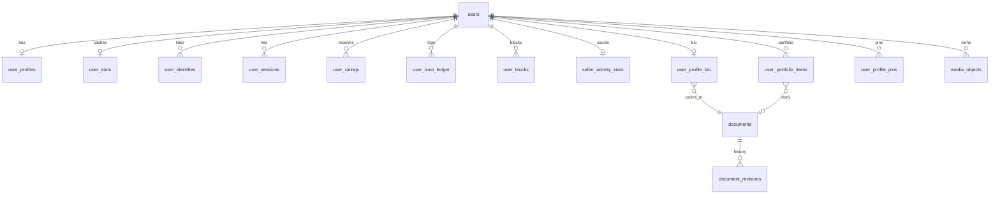

# Zula database schema

**Canonical DDL** lives in SQLDelight migrations under `server/src/main/sqldelight/com/zula/` (init: `0.sqm`). Query files (`.sq`) hold statements only — `deriveSchemaFromMigrations = true`. This document is the index by module — update it when adding tables or migrations.

**Shipped schema:** `0.sqm` (users, profiles, portfolio, media_objects, traits, feed, groups, trades, chat)  
**Version bookkeeping:** `zula_schema_version` created in Kotlin (`Database.kt`), not in `.sqm`.  
**Removed:** `auth_challenges` (email OTP leftover) — dropped on migrate if present.  
**Next:** geolocation / moderation as further `0.sqm` appends (pre-prod) or `1.sqm+` post-prod.

**PostgreSQL:** 18+ required (`uuidv7()` is built-in). The server checks `server_version_num >= 180000` at startup.

---

## Core utilities

| Object | Purpose |
|--------|---------|
| `uuidv7()` | UUID PKs (PostgreSQL 18+ built-in UUIDv7) |

Entity tables use `id UUID PRIMARY KEY DEFAULT uuidv7()` and **no `created_at`** — create time is in the UUIDv7 timestamp field (`Ids.createdAtMillis`).

**Assignment rule:** omit `id` on `INSERT` and use `RETURNING id`. Do **not** generate ids in application code or clients unless unavoidable (e.g. ephemeral username suffix). Session ids (`sid` JWT claim) are DB-assigned via `insertSession` before the access token is issued.

Create endpoints return persisted ids in the response (e.g. `AuthTokensResponse.sessionId`, feed item id after `POST /api/feed/items`) so clients can reconcile optimistic UI after the server assigns ids.

---

## User & auth module

*Doc: [user_module.md](./user_module.md)*

| Table | Purpose |
|-------|---------|
| `users` | Identity: UUIDv7 `id`, `username` |
| `user_profiles` | Display: `display_name`, `avatar_url`, `timezone`, `preferred_language`, `location_tag`, `seller_headline` |
| `user_identities` | OAuth links (`google`, `apple`) |
| `user_sessions` | JWT session hashes, revocation |
| `user_stats` | Cached `explicit_rating_avg`, `implicit_trust_score` |
| `user_ratings` | Peer star ratings + comments |
| `user_trust_ledger` | Immutable trust deltas — see [trust_events.md](./trust_events.md) |
| `user_blocks` | Blocker ↔ blocked pairs |

---

## Seller profile module

*Doc: [seller_profile_module.md](./seller_profile_module.md)* — same tables as user; no separate seller entity.

| Table | Purpose |
|-------|---------|
| `seller_activity_stats` | Denormalized offer/need/trip/fulfilled counts (sync when feed ships) |

---

## Profile & portfolio module

*Doc: [profile_portfolio_module.md](./profile_portfolio_module.md)*

| Table | Purpose |
|-------|---------|
| `documents` | Canonical markdown (`source`, `format`, `revision`) |
| `document_revisions` | Optional audit trail |
| `user_profile_bio` | One markdown bio document per user |
| `user_portfolio_items` | Curated portfolio entries |
| `user_profile_pins` | Up to 6 pinned portfolio items |

**Future FKs (when modules ship):** `user_portfolio_items.feed_item_id` → `feed_items`; `trade_id` → `trades`.

---

## Traits module

*Doc: [traits_module.md](./traits_module.md)* · DDL in `0.sqm`

| Table | Purpose |
|-------|---------|
| `traits` | Tree: `parent_id`, `slug`, `sort_order` |
| `feed_item_traits` | M:N feed item ↔ trait |

---

## Feed module

*Doc: [feed_module.md](./feed_module.md)* · DDL in `0.sqm`

| Table | Purpose |
|-------|---------|
| `feed_items` | Posts: kind, status, author, `group_id`, like/comment counts, `last_bumped_at`, optional `default_location_mode` |
| `feed_item_media` | Object keys + sort order |
| `feed_item_likes` | Like = bump |
| `feed_item_comments` | Public comments |
| `feed_item_bookmarks` | Private saves |
| `user_trait_follows` | User follows trait |
| `user_interest_profiles` | Interest profile marker (ranking deferred) |

---

## Media module

*Doc: [media_module.md](./media_module.md)* · DDL in `0.sqm`

`features:media` owns the **registry** and MinIO lifecycle (Ktor proxy upload/download + JobRunr GC).
### Registry

| Table | Purpose |
|-------|---------|
| `media_objects` | Canonical record per S3 object: owner, status, `ref_count`, GC timestamps |

```sql
CREATE TABLE media_objects (
    object_key     text PRIMARY KEY,
    owner_user_id  UUID NOT NULL REFERENCES users(id) ON DELETE CASCADE,
    status         text NOT NULL CHECK (status IN ('pending', 'active', 'deleted')),
    content_type   text,
    byte_size      bigint,
    ref_count      int NOT NULL DEFAULT 0 CHECK (ref_count >= 0),
    created_at     timestamptz NOT NULL DEFAULT CURRENT_TIMESTAMP,
    committed_at   timestamptz,
    delete_after   timestamptz
);

CREATE INDEX media_objects_owner_idx
    ON media_objects (owner_user_id, status);

CREATE INDEX media_objects_gc_idx
    ON media_objects (status, delete_after)
    WHERE status IN ('pending', 'deleted');
```

| Column | Notes |
|--------|-------|
| `object_key` | `uploads/{user_id}/{uuid}` — same string stored in feature tables |
| `status` | `pending` → `active` on commit; `deleted` when `ref_count` reaches 0 |
| `ref_count` | Increment on `commitKeys`; decrement on `releaseKey` |
| `delete_after` | Set when status becomes `deleted`; GC deletes S3 object after grace |

### Reference sites (not FK to `media_objects`)

Keys are validated at write time; no FK to keep feed/profile migrations independent.

| Location | Column | Owner feature |
|----------|--------|---------------|
| `feed_item_media` | `object_key` | `features:feed` |
| `user_portfolio_items` | `cover_object_key` | `features:user` |
| `user_profiles` | `avatar_url` | `features:user` |

On delete/replace, owning feature calls `releaseKey`. On create/link, calls `commitKeys` in the same transaction.

### GC queries (SQLDelight: `media.sq`)

| Query | Purpose |
|-------|---------|
| `selectGcPendingOrphans` | `pending` older than 24h |
| `selectGcDeletedReady` | `deleted`, `ref_count = 0`, past `delete_after` |
| `deleteMediaObject` | Remove row after successful S3 delete |

### Related feed table

| Table | Purpose |
|-------|---------|
| `feed_item_media` | Per-item media rows: `object_key`, `sort_order`, optional `embedding` |

Defined in feed migration (`000002_feed.sql`). See [feed_module.md](./feed_module.md). Wave 1: `feed_items.group_id` → [groups](#groups-module-planned).

---

## Groups module

*Doc: [groups_module.md](./groups_module.md)* · DDL in `0.sqm`

| Table | Purpose |
|-------|---------|
| `groups` | Community: slug, title, visibility, owner |
| `group_members` | Membership + role (`owner` / `admin` / `member`) |

Feed/chat FKs: `feed_items.group_id`, `chat_rooms.group_id`.

---

## Geolocation module *(planned — Wave 2)*

*Doc: [geolocation_module.md](./geolocation_module.md)* · migration: `000004_geolocation.sql`

| Table | Purpose |
|-------|---------|
| `network_fingerprint_events` | Hashed fingerprints, TTL purge |

Writes to `user_profiles.location_tag`; optional `feed_items.origin_location_tag` on trip posts.

Trade **location modes** (`provider` / `client` / `negotiated`) live under [trade](#trade-module-planned--wave-3) — not in geolocation tables.

---

## Trade module

*Doc: [trade_module.md](./trade_module.md)* · DDL in `0.sqm`

| Table | Purpose |
|-------|---------|
| `trades` | Lifecycle state, template type, `location_mode` |
| `trade_participants` | Initiator + counterparty |
| `trade_items` | Linked feed items / sides |
| `trade_locations` | Fulfillment place (post-accept for `client` mode) |

Payment columns / intent ids: **deferred**; MVP keeps `PaymentGateway` port only.

---

## Chat module

*Doc: [chat_module.md](./chat_module.md)* · DDL in `0.sqm`

| Table | Purpose |
|-------|---------|
| `chat_rooms` | Trade- or group-scoped |
| `chat_participants` | Membership |
| `chat_messages` | Persisted messages + `client_message_id` |
| `sse_event_log` | Durable SSE replay for `Last-Event-ID` |

---

## Moderation module *(planned — Wave 5)*

*Doc: [moderation_module.md](./moderation_module.md)* · migration: `000008_moderation.sql`

| Table | Purpose |
|-------|---------|
| `user_reports` | User reports |
| `content_reports` | Feed/chat content reports |
| `moderation_actions` | Admin audit log |

---

## Entity relationship (shipped tables)



---

## Related

- [architecture.md](./architecture.md) — which service owns writes
- [conventions.md](./conventions.md) — migration numbering
