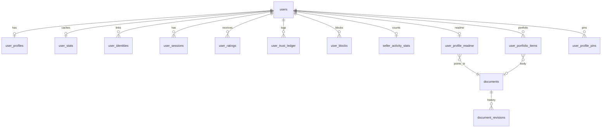

# Zula database schema

**Canonical DDL** lives in `apps/backend/db/migration/`. This document is the index by module — update it when adding migrations.

**Baseline migration:** `000001_init.up.sql`  
**Next planned:** `000002_feed.up.sql` (traits + feed — see [implementation_plan.md](./implementation_plan.md))

---

## Core utilities

| Object | Purpose |
|--------|---------|
| `generate_snowflake_id()` | BIGINT primary keys |
| `snowflake_seq` | Sequence for ID generation |

---

## User & auth module

*Doc: [user_module.md](./user_module.md)*

| Table | Purpose |
|-------|---------|
| `users` | Identity: `id`, `username`, `created_at` |
| `user_profiles` | Display: `display_name`, `avatar_url`, `bio`, `timezone`, `preferred_language`, `location_tag`, `seller_headline` |
| `user_identities` | OAuth links (`google`, `apple`) |
| `user_sessions` | JWT session hashes, revocation |
| `user_stats` | Cached `explicit_rating_avg`, `implicit_trust_score` |
| `user_ratings` | Peer star ratings + comments |
| `user_trust_ledger` | Immutable trust deltas — see [trust_events.md](./trust_events.md) |
| `user_blocks` | Blocker ↔ blocked pairs |

---

## Seller profile module

*Doc: [seller_profile_module.md](./seller_profile_module.md)* — same tables as user; no separate seller entity.

| Table | Purpose |
|-------|---------|
| `seller_activity_stats` | Denormalized offer/need/trip/fulfilled counts (sync when feed ships) |

---

## Profile & portfolio module

*Doc: [profile_portfolio_module.md](./profile_portfolio_module.md)*

| Table | Purpose |
|-------|---------|
| `documents` | Canonical markdown (`source`, `format`, `revision`) |
| `document_revisions` | Optional audit trail |
| `user_profile_readme` | One readme document per user |
| `user_portfolio_items` | Curated portfolio entries |
| `user_profile_pins` | Up to 6 pinned portfolio items |

**Future FKs (when modules ship):** `user_portfolio_items.feed_item_id` → `feed_items`; `trade_id` → `trades`.

---

## Traits module *(planned — Wave 1)*

*Doc: [traits_module.md](./traits_module.md)* · migration: `000002_feed.up.sql`

| Table | Purpose |
|-------|---------|
| `traits` | Tree: `parent_id`, `slug`, `sort_order` |
| `feed_item_traits` | M:N feed item ↔ trait |

---

## Feed module *(planned — Wave 1)*

*Doc: [feed_module.md](./feed_module.md)*

| Table | Purpose |
|-------|---------|
| `feed_items` | Posts: kind, status, author, embedding, `body_document_id` |
| `feed_item_media` | Object keys + optional `vector` embedding |
| `user_trait_follows` | User follows trait |
| `user_interest_profiles` | Interest vector for ranking |
| `feed_item_cards` | Optional denormalized projection (Phase F) |

---

## Media module *(planned — Wave 2)*

*Doc: [media_module.md](./media_module.md)*

Uses `feed_item_media`, portfolio `cover_object_key`, `user_profiles.avatar_url` (validated key/URL). No separate media table required for MVP.

---

## Geolocation module *(planned — Wave 2)*

*Doc: [geolocation_module.md](./geolocation_module.md)* · migration: `000004_geolocation.up.sql`

| Table | Purpose |
|-------|---------|
| `network_fingerprint_events` | Hashed fingerprints, TTL purge |

Writes to `user_profiles.location_tag`; optional `feed_items.origin_location_tag` on trip posts.

---

## Trade module *(planned — Wave 3)*

*Doc: [trade_module.md](./trade_module.md)* · migration: `000005_trades.up.sql`

| Table | Purpose |
|-------|---------|
| `trades` | Lifecycle state, template type |
| `trade_participants` | Initiator + counterparty |
| `trade_items` | Linked feed items / sides |
| `trade_public_disclosures` | Opt-in public summaries |

---

## Validation module *(planned — Wave 3)*

*Doc: [validation_module.md](./validation_module.md)* · migration: `000007_validation.up.sql`

| Table | Purpose |
|-------|---------|
| `validation_sessions` | Hashed codes bound to `trade_id` |

---

## Chat module *(planned — Wave 3)*

*Doc: [chat_module.md](./chat_module.md)* · migration: `000006_chat.up.sql`

| Table | Purpose |
|-------|---------|
| `chat_rooms` | One per trade (MVP) |
| `chat_participants` | Membership |
| `chat_messages` | Persisted messages |

---

## Moderation module *(planned — Wave 5)*

*Doc: [moderation_module.md](./moderation_module.md)* · migration: `000008_moderation.up.sql`

| Table | Purpose |
|-------|---------|
| `user_reports` | User reports |
| `content_reports` | Feed/chat content reports |
| `moderation_actions` | Admin audit log |

---

## Entity relationship (shipped tables)

---

## Related

- [architecture.md](./architecture.md) — which service owns writes
- [conventions.md](./conventions.md) — migration numbering
