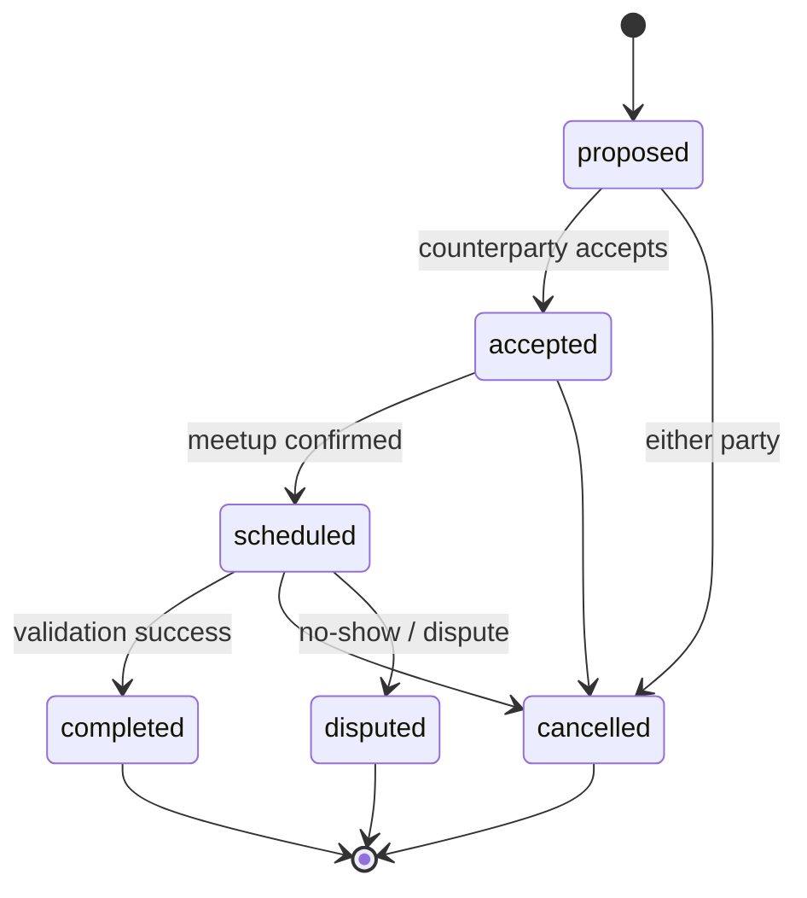

# Guide: Trade Module (Deal Coordination)

**Trade templates** for **barter/swap** and **cash meetups**. Platform coordinates state and handoff — **no in-app card payments** in the current plan.

**Status:** Doc complete · **Backend:** ⬜ · **Feature:** `features:trade`

**Depends on:** [feed_module.md](./feed_module.md), [user_module.md](./user_module.md) · **Unblocks:** [validation](./validation_module.md), [chat](./chat_module.md), [profile_portfolio](./profile_portfolio_module.md) portfolio-E

**Master plan:** [implementation_plan.md](./implementation_plan.md) Wave 3 (`trade-A` … `trade-D`) · **Product:** [product_vision.md](./product_vision.md)

**Related:** [architecture.md](./architecture.md) · [schema.md](./schema.md#trade-module-planned--wave-3) · [trust_events.md](./trust_events.md)

---

## Goals

| Goal | Detail |
|------|--------|
| **Trade entity** | Initiator + counterparty, linked feed item(s), lifecycle |
| **Templates** | `swap` (barter), `meetup_cash` (cash meetup coordination) |
| **State machine** | Backend-owned transitions |
| **Trust hook** | Completion → validation → ledger |
| **Public disclosure** | Opt-in summaries for profiles |
| **Safety** | Protect both parties’ time/reputation; payments stay off-platform unless product adds escrow later |

---

## Architecture



Feed item status coupling: `active` → `in_trade` → `fulfilled` or back to `active` on cancel.

Feature layout:

| Layer | File | Purpose |
|-------|------|---------|
| Routing | `TradeRouting.kt` | HTTP paths, OpenAPI metadata |
| Service | `TradeService.kt` | State machine, feed linkage, meetup scheduling |
| Integration | `TradePublisher.kt` / `TradeConsumer.kt` | Room creation events, expiry jobs (planned) |

Register in Koin (`tradeModule`) and mount routes from `Application.kt` via `configureTradeRouting()`.

---

## Schema

| Table | Purpose |
|-------|---------|
| `trades` | State, template type, timestamps |
| `trade_participants` | Initiator + counterparty |
| `trade_items` | Linked feed items / sides |
| `trade_public_disclosures` | Opt-in public summaries |

**Next migration:** `000005_trades.sql` — [schema.md](./schema.md#trade-module-planned--wave-3)

---

## REST / OpenAPI surface

| Operation | Auth |
|-----------|------|
| `CreateTrade` | Auth |
| `AcceptTrade` / `CancelTrade` | Auth |
| `GetTrade` | Auth (participants) |
| `ProposeMeetup` / `ConfirmMeetup` | Auth |

[api_index.md](./api_index.md)

---

## Auth policy

Participants only for read/write. [auth_and_permissions.md](./auth_and_permissions.md)

---

## Implementation phases

### Phase trade-A — Schema & core routes

- [ ] Migration + `TradeService`
- [ ] `CreateTrade`, `AcceptTrade`, `CancelTrade`, `GetTrade`
- [ ] Koin: `tradeModule` + route mount in `Application.kt`
- [ ] Tests: invalid transitions rejected — `features/trade/src/test/kotlin/`

### Phase trade-B — Templates & scheduling

- [ ] Template validation (swap vs meetup)
- [ ] `ProposeMeetup`, `ConfirmMeetup`
- [ ] Expiry job for stale proposals (JobRunr recurring/delayed job)

### Phase trade-C — Feed linkage

- [ ] Start trade from `feed_item_id`; lock `in_trade`
- [ ] Restore feed status on complete/cancel

### Phase trade-D — Public history

- [ ] `trade_public_disclosures`
- [ ] `completed_trade_count` on `seller_activity_stats`

---

## Verification

```bash
./gradlew :core:database:generateSqlDelightInterface
./gradlew :core:openapi:build
./gradlew :features:trade:test
./gradlew test
```

---

## File checklist

| Path | Purpose |
|------|---------|
| `core/database/src/main/resources/db/migration/000005_trades.sql` | Schema |
| `core/database/src/main/sqldelight/trade.sq` | SQLDelight queries |
| `core/openapi/src/main/kotlin/dto/` | OpenAPI DTOs |
| `features/trade/src/main/kotlin/.../TradeRouting.kt` | HTTP routes |
| `features/trade/src/main/kotlin/.../TradeService.kt` | State machine |
| `features/trade/src/main/kotlin/.../TradePublisher.kt` | MQ publish (if any) |
| `features/trade/src/test/kotlin/...` | Tests |
| `docs/trade_module.md` | This guide |

---

## Open questions

| Question | MVP default |
|----------|-------------|
| Three-party trades | Out of scope — two parties only |
| Cash amount fields | Display only; no payment rails |
| Dispute resolution | Manual admin via moderation Wave 5 |

---

## Related documentation

- [validation_module.md](./validation_module.md) — completes trade
- [chat_module.md](./chat_module.md) — room per trade
- [profile_portfolio_module.md](./profile_portfolio_module.md) — case studies
