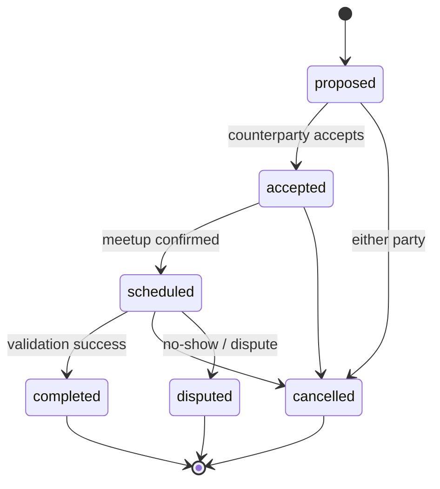

# Guide: Trade Module (Barter Coordination)

**Trade templates** for direct swaps and cash meetups. No in-app payments — coordination and state only.

**Status:** Doc complete · **Backend:** ⬜ · **Service:** `TradeService` (planned)

**Depends on:** [feed_module.md](./feed_module.md), [user_module.md](./user_module.md) · **Unblocks:** [validation](./validation_module.md), [chat](./chat_module.md), [profile_portfolio](./profile_portfolio_module.md) portfolio-E

**Master plan:** [implementation_plan.md](./implementation_plan.md) Wave 3 (`trade-A` … `trade-D`)

**Related:** [architecture.md](./architecture.md) · [schema.md](./schema.md#trade-module-planned--wave-3) · [trust_events.md](./trust_events.md)

---

## Goals

| Goal | Detail |
|------|--------|
| **Trade entity** | Initiator + counterparty, linked feed item(s), lifecycle |
| **Templates** | `swap`, `meetup_cash` |
| **State machine** | Backend-owned transitions |
| **Trust hook** | Completion → validation → ledger |
| **Public disclosure** | Opt-in summaries for profiles |

---

## Architecture



Feed item status coupling: `active` → `in_trade` → `fulfilled` or back to `active` on cancel.

---

## Schema

| Table | Purpose |
|-------|---------|
| `trades` | State, template type, timestamps |
| `trade_participants` | Initiator + counterparty |
| `trade_items` | Linked feed items / sides |
| `trade_public_disclosures` | Opt-in public summaries |

**Next migration:** `000005_trades.up.sql` — [schema.md](./schema.md#trade-module-planned--wave-3)

---

## Proto / RPC surface

| RPC | Auth |
|-----|------|
| `CreateTrade` | Auth |
| `AcceptTrade` / `CancelTrade` | Auth |
| `GetTrade` | Auth (participants) |
| `ProposeMeetup` / `ConfirmMeetup` | Auth |

[api_index.md](./api_index.md)

---

## Auth policy

Participants only for read/write. [auth_and_permissions.md](./auth_and_permissions.md)

---

## Implementation phases

### Phase trade-A — Schema & core RPCs

- [ ] Migration + `TradeService`
- [ ] `CreateTrade`, `AcceptTrade`, `CancelTrade`, `GetTrade`
- [ ] Tests: invalid transitions rejected — `apps/backend/tests/trade/`

### Phase trade-B — Templates & scheduling

- [ ] Template validation (swap vs meetup)
- [ ] `ProposeMeetup`, `ConfirmMeetup`
- [ ] Expiry job for stale proposals

### Phase trade-C — Feed linkage

- [ ] Start trade from `feed_item_id`; lock `in_trade`
- [ ] Restore feed status on complete/cancel

### Phase trade-D — Public history

- [ ] `trade_public_disclosures`
- [ ] `completed_trade_count` on `seller_activity_stats`

---

## Verification

```bash
gen-openapi
devenv test
cd apps/backend && go test ./tests/trade/...
```

---

## File checklist

| Path | Purpose |
|------|---------|
| `apps/backend/db/migration/000005_trades.up.sql` | Schema |
| `apps/backend/internal/apitypes/` | API |
| `apps/backend/internal/service/trade.go` | State machine |
| `docs/trade_module.md` | This guide |

---

## Open questions

| Question | MVP default |
|----------|-------------|
| Three-party trades | Out of scope — two parties only |
| Cash amount fields | Display only; no payment rails |
| Dispute resolution | Manual admin via moderation Wave 5 |

---

## Related documentation

- [validation_module.md](./validation_module.md) — completes trade
- [chat_module.md](./chat_module.md) — room per trade
- [profile_portfolio_module.md](./profile_portfolio_module.md) — case studies
