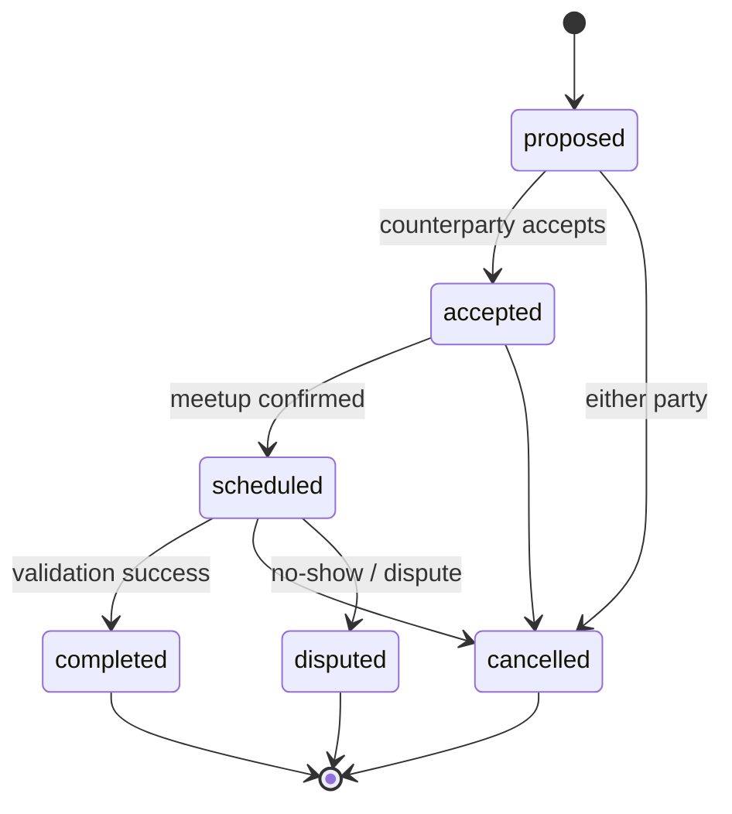

# Guide: Trade Module (Deal Coordination)

**Trade templates** for **barter/swap** and **cash meetups**, plus a **location decision matrix**. Platform coordinates state and handoff.

**Payments:** **not in MVP**. Keep a **payment-ready seam** (`PaymentGateway` port + reserved trade/SSE event names) so Stripe / PayU / BLIK / InPost can plug in later without rewriting the state machine.

**Status:** Doc complete · **Backend:** ✅ A–C (validation PIN deferred) · **Feature:** `features:trade`

**Depends on:** [feed_module.md](./feed_module.md), [user_module.md](./user_module.md) · **Unblocks:** [validation](./validation_module.md), [chat](./chat_module.md), [profile_portfolio](./profile_portfolio_module.md) portfolio-E

**Master plan:** [implementation_plan.md](./implementation_plan.md) Wave 3 (`trade-A` … `trade-D`) · **Product:** [product_vision.md](./product_vision.md)

**Related:** [architecture.md](./architecture.md) · [schema.md](./schema.md#trade-module-planned--wave-3) · [trust_events.md](./trust_events.md) · [geolocation_module.md](./geolocation_module.md) (fingerprints — complementary)

---

## Goals

| Goal | Detail |
|------|--------|
| **Trade entity** | Initiator + counterparty, linked feed item(s), lifecycle |
| **Templates** | `swap` (barter), `meetup_cash` (cash meetup coordination) |
| **Location modes** | `provider` / `client` / `negotiated` — who decides place of fulfillment |
| **State machine** | Backend-owned transitions |
| **Trust hook** | Completion → validation → ledger |
| **Public disclosure** | Opt-in summaries for profiles |
| **Payment prep** | Port + event hooks only; **no live payment rails in MVP** |
| **Safety** | Protect both parties’ time/reputation |

---

## Location decision matrix

Set on offer defaults and/or during trade negotiation:

| Mode | Who decides place | Typical use | Exact address |
|------|-------------------|-------------|---------------|
| `provider` | Supplier | Workshop, salon, tutor’s place | Optional public / shared by provider |
| `client` | Buyer | Mobile service (cleaning, plumber, home tutor) | Shared **after** accept (not on public feed) |
| `negotiated` | Mutual | Neutral meetup, trip pickup, swap | Agreed in chat / meetup propose |

Complements coarse **fingerprint** `location_tag` used for discovery ([geolocation_module.md](./geolocation_module.md)) — matrix = logistics; fingerprints = ranking/matching.

---

## Architecture



Feed item status coupling: `active` → `in_trade` → `fulfilled` or back to `active` on cancel.

**Future payment branch (post-MVP, reserved):** after `accepted` / `scheduled`, a payment integration may emit SSE `PAYMENT_SUCCESS` / `PAYMENT_FAILED` without changing core handoff → `completed` via validation. MVP does not implement this branch.

Feature layout:

| Layer | File | Purpose |
|-------|------|---------|
| Routing | `TradeRouting.kt` | HTTP paths, OpenAPI metadata |
| Service | `TradeService.kt` | State machine, feed linkage, location modes, meetup scheduling |
| Integration | `TradePublisher.kt` / `TradeConsumer.kt` | Room creation events, expiry jobs; later payment webhooks |
| Port | `PaymentGateway` *(stub)* | Interface only in MVP — no Stripe/PayU impl |

Register in Koin (`tradeModule`) and mount routes from `Application.kt` via `configureTradeRouting()`.

---

## Schema

| Table | Purpose |
|-------|---------|
| `trades` | State, template type, `location_mode`, timestamps |
| `trade_participants` | Initiator + counterparty |
| `trade_items` | Linked feed items / sides |
| `trade_locations` | Mode-specific place data (opaque address ciphertext / meetup note after accept) |
| `trade_public_disclosures` | Opt-in public summaries |

Optional on `feed_items` (Wave 1 or 3): `default_location_mode` for offers.

**Next migration:** `000005_trades.sql` — [schema.md](./schema.md#trade-module-planned--wave-3)

---

## REST / OpenAPI surface

| Operation | Auth |
|-----------|------|
| `CreateTrade` | Auth |
| `AcceptTrade` / `CancelTrade` | Auth |
| `GetTrade` | Auth (participants) |
| `SetLocationMode` / `SetFulfillmentPlace` | Auth (participants; place rules by mode) |
| `ProposeMeetup` / `ConfirmMeetup` | Auth |

[api_index.md](./api_index.md)

---

## Payment integration prep (MVP stub)

| Piece | MVP | Post-MVP |
|-------|-----|----------|
| `PaymentGateway` Koin interface | Empty / no-op binding | Stripe Connect / PayU adapter |
| SSE event names | Document reserved: `PAYMENT_SUCCESS`, `PAYMENT_FAILED` | Emit from webhook consumer |
| Trade columns | Optional nullable `payment_intent_id` / `payment_status` **or** defer columns until wave | Wire real values |
| Recurring / InPost | Out of scope | Separate wave |

Do **not** call external payment APIs in MVP tests.

---

## Auth policy

Participants only for read/write. Client-mode addresses never on public feed. [auth_and_permissions.md](./auth_and_permissions.md)

---

## Implementation phases

### Phase trade-A — Schema & core routes

- [ ] Migration + `TradeService`
- [ ] `CreateTrade`, `AcceptTrade`, `CancelTrade`, `GetTrade`
- [ ] `location_mode` on `trades` (`provider` \| `client` \| `negotiated`)
- [ ] Koin: `tradeModule` + route mount in `Application.kt`
- [ ] Register no-op `PaymentGateway` binding
- [ ] Tests: invalid transitions rejected — `features/trade/src/test/kotlin/`

### Phase trade-B — Templates, location & scheduling

- [ ] Template validation (swap vs meetup)
- [ ] `SetLocationMode`, `SetFulfillmentPlace` (address after accept for `client`)
- [ ] `ProposeMeetup`, `ConfirmMeetup`
- [ ] Expiry job for stale proposals (JobRunr recurring/delayed job)

### Phase trade-C — Feed linkage + payment hooks

- [ ] Start trade from `feed_item_id`; lock `in_trade`
- [ ] Restore feed status on complete/cancel
- [ ] Document reserved SSE payment events; publish `TRADE_STATE_CHANGED` on transitions

### Phase trade-D — Public history

- [ ] `trade_public_disclosures`
- [ ] `completed_trade_count` on `seller_activity_stats`

---

## Verification

```bash
./gradlew :core:database:generateSqlDelightInterface
./gradlew :core:openapi:build
./gradlew :features:trade:test
./gradlew test
```

---

## File checklist

| Path | Purpose |
|------|---------|
| `core/database/src/main/resources/db/migration/000005_trades.sql` | Schema |
| `core/database/src/main/sqldelight/trade.sq` | SQLDelight queries |
| `core/openapi/src/main/kotlin/dto/` | OpenAPI DTOs |
| `core/contracts/PaymentGateway.kt` | Payment port (stub) |
| `features/trade/src/main/kotlin/.../TradeRouting.kt` | HTTP routes |
| `features/trade/src/main/kotlin/.../TradeService.kt` | State machine |
| `features/trade/src/main/kotlin/.../TradePublisher.kt` | Events |
| `features/trade/src/test/kotlin/...` | Tests |
| `docs/trade_module.md` | This guide |

---

## Open questions

| Question | MVP default |
|----------|-------------|
| Three-party trades | Out of scope — two parties only |
| Cash amount fields | Display only; no payment rails |
| Dispute resolution | Manual admin via moderation Wave 5 |
| Encrypt client addresses at rest | Prefer; document in PR if deferred |

---

## Related documentation

- [validation_module.md](./validation_module.md) — completes trade
- [chat_module.md](./chat_module.md) — room per trade + SSE
- [geolocation_module.md](./geolocation_module.md) — fingerprint tags
- [profile_portfolio_module.md](./profile_portfolio_module.md) — case studies
