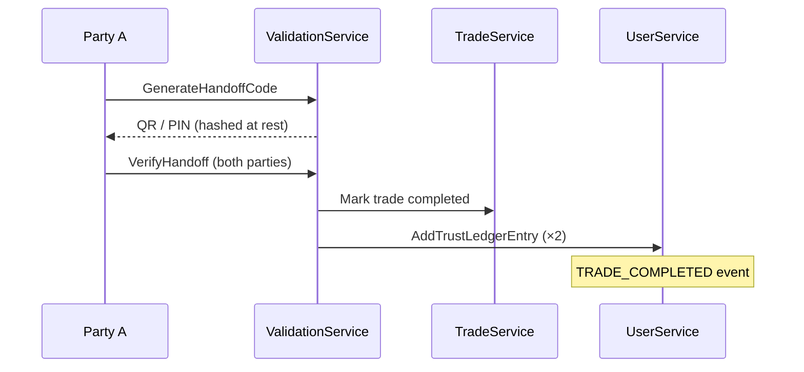

# Guide: Validation Module (Hand-to-Hand)

**PIN/QR verification** at meetup/handoff. Success updates **trust scores** and unlocks **peer ratings**.

**Status:** Doc complete · **Backend:** ⬜ · **Feature:** `features:validation`

**Depends on:** [trade_module.md](./trade_module.md) · **Unblocks:** [user_module.md](./user_module.md) public ratings (Wave 3.5)

**Master plan:** [implementation_plan.md](./implementation_plan.md) Wave 3.4 (`validation-A`, `validation-B`)

**Related:** [trust_events.md](./trust_events.md) · [auth_and_permissions.md](./auth_and_permissions.md)

---

## Goals

| Goal | Detail |
|------|--------|
| **One-time codes** | Short-lived PIN/QR bound to `trade_id` |
| **Dual confirm** | Both parties verify before complete |
| **Trust delta** | Ledger + cache via UserService |
| **Rating unlock** | `RecordPeerRating` allowed after validation |
| **No secret leakage** | Store `code_hash` only |

---

## Architecture



Feature layout:

| Layer | File | Purpose |
|-------|------|---------|
| Routing | `ValidationRouting.kt` | HTTP paths, OpenAPI metadata |
| Service | `ValidationService.kt` | Code generation, verify, trust coordination |
| Integration | — | Trust writes via Koin `TrustLedgerWriter` (no MQ in MVP) |

Register in Koin (`validationModule`) and mount routes from `Application.kt` via `configureValidationRouting()`.

---

## Schema

| Table | Purpose |
|-------|---------|
| `validation_sessions` | `trade_id`, `code_hash`, `expires_at`, `status` |

**Next migration:** `000007_validation.sql` — [schema.md](./schema.md#validation-module-planned--wave-3)

---

## REST / OpenAPI surface

| Operation | Auth |
|-----------|------|
| `GenerateHandoffCode` | Auth (participant) |
| `VerifyHandoff` | Auth (participant) |

Link: [api_index.md](./api_index.md)

---

## Auth policy

Trade participants only. [auth_and_permissions.md](./auth_and_permissions.md)

---

## Implementation phases

### Phase validation-A — Code generation

- [ ] `validation_sessions` table
- [ ] `GenerateHandoffCode` REST route
- [ ] QR payload format: `trade_id + nonce + HMAC`
- [ ] Koin: `validationModule` + route mount in `Application.kt`
- [ ] Tests: `features/validation/src/test/kotlin/`

### Phase validation-B — Verify & complete

- [ ] `VerifyHandoff` — **MVP policy:** single device dual entry OR both scan (pick one in PR)
- [ ] On success: trade → completed, trust ledger for both users (via `TrustLedgerWriter`)
- [ ] Gate `RecordPeerRating` on validation success

### Phase validation-C — Abuse controls

- [ ] Rate limits, max attempts
- [ ] Admin override hook for moderation

---

## Verification

```bash
./gradlew :core:database:generateSqlDelightInterface
./gradlew :features:validation:test
./gradlew test
# E2E: trade flow → trust score change (see README.md)
```

---

## File checklist

| Path | Purpose |
|------|---------|
| `core/database/src/main/resources/db/migration/000007_validation.sql` | Sessions |
| `core/database/src/main/sqldelight/validation.sq` | SQLDelight queries |
| `core/openapi/src/main/kotlin/dto/` | OpenAPI DTOs |
| `features/validation/src/main/kotlin/.../ValidationRouting.kt` | HTTP routes |
| `features/validation/src/main/kotlin/.../ValidationService.kt` | Business logic |
| `features/validation/src/test/kotlin/...` | Tests |
| `docs/validation_module.md` | This guide |

---

## Open questions

| Question | MVP default |
|----------|-------------|
| Single-device vs dual-device verify | **Dual scan** — each party scans other's QR |
| Code length | 6-digit PIN + signed QR payload |
| Failed validation trust hit | `VALIDATION_FAILED` −5 per [trust_events.md](./trust_events.md) |

---

## Related documentation

- [trade_module.md](./trade_module.md) — lifecycle
- [user_module.md](./user_module.md) — ledger writers
- [moderation_module.md](./moderation_module.md) — disputes
